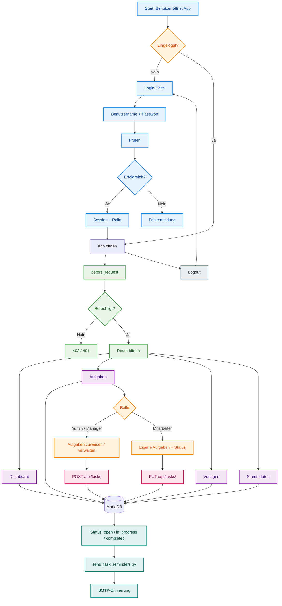

# Test

```mermaid
flowchart TD
    classDef login fill:#E3F2FD,stroke:#1E88E5,stroke-width:2px,color:#0D47A1;
    classDef access fill:#E8F5E9,stroke:#43A047,stroke-width:2px,color:#1B5E20;
    classDef role fill:#FFF3E0,stroke:#FB8C00,stroke-width:2px,color:#E65100;
    classDef data fill:#F3E5F5,stroke:#8E24AA,stroke-width:2px,color:#4A148C;
    classDef task fill:#FCE4EC,stroke:#D81B60,stroke-width:2px,color:#880E4F;
    classDef mail fill:#E0F2F1,stroke:#00897B,stroke-width:2px,color:#004D40;
    classDef endnode fill:#ECEFF1,stroke:#607D8B,stroke-width:2px,color:#263238;

    A[Start: Benutzer öffnet App] --> B{Eingeloggt?}
    class A login
    class B role

    B -- Nein --> C[Login-Seite]
    C --> D[Benutzername + Passwort]
    D --> E[Prüfen]
    E --> F{Erfolgreich?}
    F -- Ja --> G[Session + Rolle]
    F -- Nein --> H[Fehlermeldung]
    G --> I[App öffnen]
    class C,D,E,F,G,H login

    B -- Ja --> I
    I --> J[before_request]
    J --> K{Berechtigt?}
    K -- Nein --> L[403 / 401]
    K -- Ja --> M[Route öffnen]
    class J,K,L,M access

    M --> N[Dashboard]
    M --> O[Aufgaben]
    M --> P[Vorlagen]
    M --> Q[Stammdaten]

    N --> R[(MariaDB)]
    O --> R
    P --> R
    Q --> R
    class N,O,P,Q data

    O --> S{Rolle}
    S -- Admin / Manager --> T[Aufgaben zuweisen / verwalten]
    S -- Mitarbeiter --> U[Eigene Aufgaben + Status]
    class S,T,U role

    T --> V[POST /api/tasks]
    U --> W[PUT /api/tasks/<id>]
    V --> R
    W --> R
    class V,W task

    R --> X[Status: open / in_progress / completed]
    X --> Y[send_task_reminders.py]
    Y --> Z[SMTP-Erinnerung]
    class X,Y,Z mail

    I --> AA[Logout]
    AA --> C
    class AA endnode
```