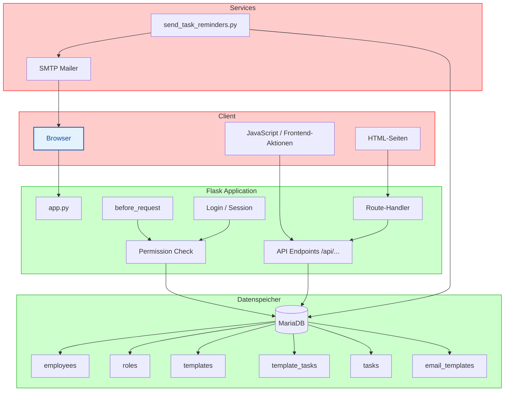

```mermaid
flowchart TB
    subgraph Client
        U1[Browser]
        U2[HTML-Seiten]
        U3[JavaScript / Frontend-Aktionen]
    end

    subgraph AppLayer[Flask Application]
        A1[app.py]
        A2[before_request]
        A3[Login / Session]
        A4[Route-Handler]
        A5[API Endpoints /api/...]
        A6[Permission Check]
    end

    subgraph DataLayer[Datenspeicher]
        D1[(MariaDB)]
        D2[employees]
        D3[roles]
        D4[templates]
        D5[template_tasks]
        D6[tasks]
        D7[email_templates]
    end

    subgraph Services
        S1[send_task_reminders.py]
        S2[SMTP Mailer]
    end

    U1 --> A1
    U2 --> A4
    U3 --> A5

    A2 --> A6
    A3 --> A6
    A6 --> D1

    A4 --> A5
    A5 --> D1

    D1 --> D2
    D1 --> D3
    D1 --> D4
    D1 --> D5
    D1 --> D6
    D1 --> D7

    S1 --> D1
    S1 --> S2
    S2 --> U1

    classDef rot fill:#ffcccc,stroke:#ff0000; 
    classDef gruen fill:#ccffcc,stroke:#00aa00;
    style U1 fill:#E3F2FD,stroke:#1565C0,stroke-width:2px,color:#0D47A1
    class Services,Client rot; 
    class DataLayer,AppLayer gruen;
```